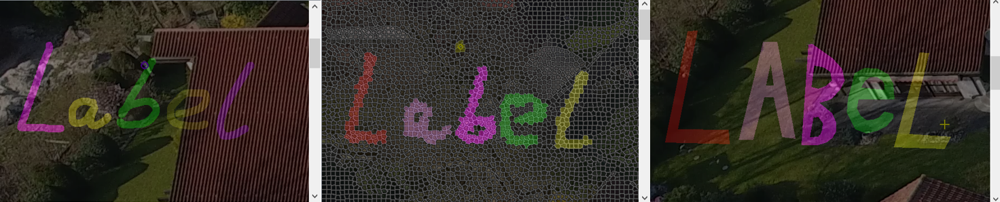
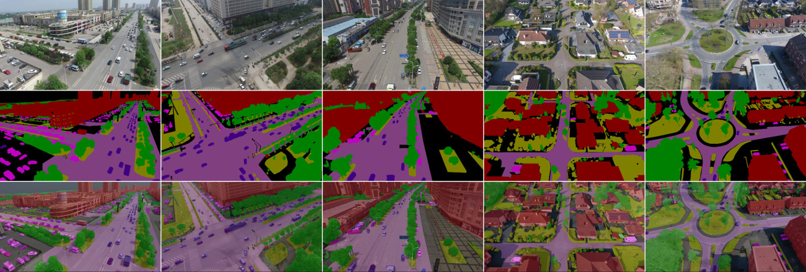

# Video Semantic Labeler
This tool is used for making video semantic labeling ground truth data. It has been used for UAVid dataset. 
This tool is built with Visual Studio2015 with qt5.6.2 and opencv3.3.0 for windows platform.

## Features
You can use the tool to play the video at specific frame index or to label the video images. 
This tool supports three types of labeling. 1)pixel-wise labeling. 2)superpixel-wise labeling. 3)polygon-wise labeling.

## Usage
You can setup your own visual studio project or use the compiled binary in the deploy folder. 
To use the binary in the deploy folder, first, comfigure your **processSetting.xml** file.
Then, open **LabelerSoftWare.exe** to start your process.
A **readme.pdf** in deploy folder can also be found serving as a guide for you.

## Use for your own video dataset
You can set your own label list in **processSetting.xml** file in the same way as the default one by specify your own class names and colors for your own purpose.

## Citation
Please cite 'UAVid' in your publication if it helps your research:

	@misc{1810.10438,
		Author = {Ye Lyu and 
				  George Vosselman and 
				  Guisong Xia and 
				  Alper Yilmaz and 
				  Michael Ying Yang},
		Title  = {The UAVid Dataset for Video Semantic Segmentation},
		Year   = {2018},
		Eprint = {arXiv:1810.10438},
	}

## Enjoy your labeling!
**UAVid dataset example**

## Contact
Author: [Ye Lyu](https://yelyuut.github.io/)  
Email: y.lyu@utwente.nl
